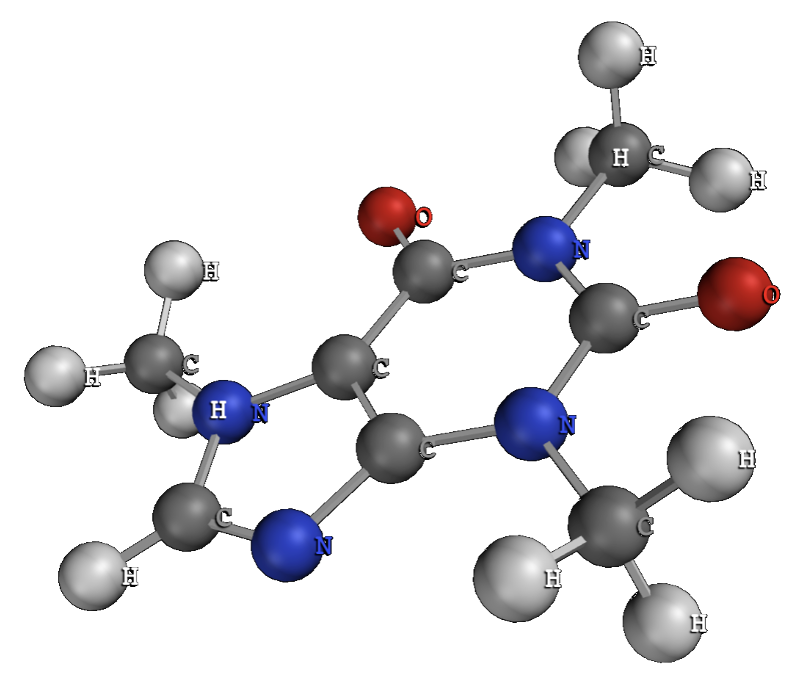
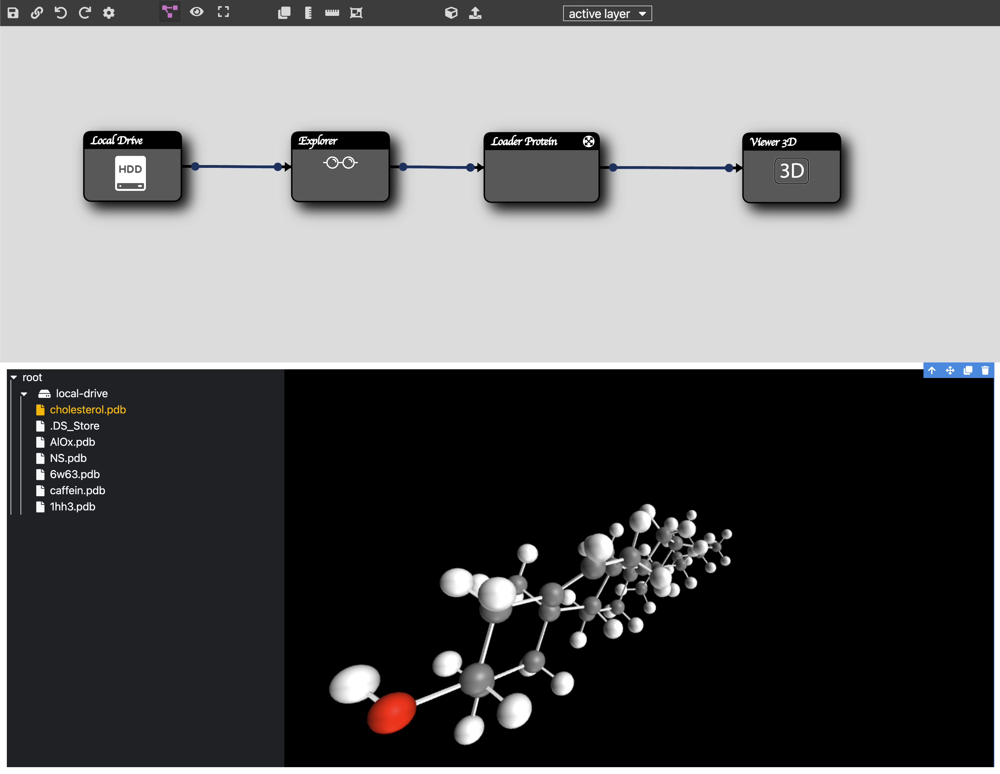

# flux-pdb 
A PDB loader for YouWol flux.
This brick enables to load a Protein Data Bank object to visualize with three.js.

A basic flux skeleton (prototype) to use the flux-pdb and visualize the loaded 3D object in a 3D viewer. 

## Documentation
You can find the documentation [here](https://roman105.github.io/flux-pdb/dist/docs/).

## Contributions

The YouWol project is open-source as much as possible, 
do not hesitate to contribute by creating branches and pull-requests.

> The [Youwol fullstack environment](https://pypi.org/project/youwol/) (YouWol FSE) should be used when developing
> *flux-pack*. It offers an immersive experience of the YouWol ecosystem, and lets
> you work with your favorite stack. Usually you've accessed this file using it anyway.
> All the links in what follows assumed you've started this environment.
